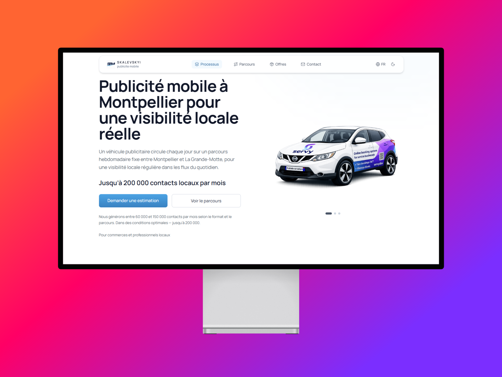

# 🚗 SPM — Skalevskyi publicité mobile

Mobile advertising SaaS landing platform based on a real-world OOH model: vehicle-based exposure, fixed route, local B2B targeting.

---

## 👀 Preview

<p align="center">
  
</p>

## 📱 Responsive Experience

<p align="center">
  
  
</p>

<p align="center">
  <i>Fully responsive SaaS landing — desktop & mobile optimized</i>
</p>


---

## 📌 About

SPM is a mobile outdoor advertising platform designed for local B2B businesses.

- 🚗 One vehicle (Nissan Qashqai)
- 📍 Fixed daily route (Montpellier → Littoral)
- 🎯 Local audience targeting
- 📊 Predictable visibility model (corridor-based, i18n)
- 🔍 SEO-driven acquisition layer (search-intent pages)

---

## ⚙️ Features

- 🧮 Dynamic pricing calculator (engine + UI separation)
- 📐 Corridor-based visibility model (i18n-driven)
- 📩 Lead capture (`POST /api/lead`, Resend, optional Upstash backup)
- 📱 Responsive, mobile-first UI (bottom nav, safe areas)
- 🌍 Multi-language support (FR / EN / UA)
- ✨ Motion with Framer Motion (reduced-motion aware)
- 🚀 Production deployment on Vercel

## 🔍 SEO Layer

- 3 search-intent pages:
  - /publicite-voiture-montpellier
  - /affichage-mobile-montpellier
  - /publicite-locale-montpellier

- Internal linking:
  - homepage → SEO pages (Hero, Concept, Footer)
  - cross-links between SEO pages

- Technical:
  - dynamic sitemap (`/sitemap.xml`)
  - robots.txt
  - canonical per route

- Google Search Console:
  - sitemap submitted
  - indexing requested

---

## 💰 Pricing & visibility model

- 💸 Pricing lives in the calculator engine (`config.ts`, `rules.ts`, `engine.ts`)
- 👁 User-facing visibility uses **corridor ranges** per format (i18n), not raw engine contact constants
- ⚠️ Internal engine constants are not treated as product truth in messaging
- 📉 CPM in the UI is a **static, corridor-aligned** explanatory line (e.g. ≈ 4 € / 1000 contacts), not dynamically computed from engine contacts

---

## 🧱 Tech stack

- ⚡ Next.js 15 (App Router)
- ⚛️ React 19
- 📘 TypeScript
- 🎨 Tailwind CSS
- 🎬 Framer Motion
- ☁️ Vercel
- ✉️ Resend
- 🗄 Upstash Redis (lead backup, production)

---

## 🏗 Architecture

- 🧠 **Engine** — calculation logic (`src/lib/calculator/`)
- ⚙️ **Config** — pricing and technical constants (`config.ts`)
- 🖥 **UI** — presentation (`OfferCalculatorPanel`, sections, i18n)

Key principle: strict separation between pricing logic and UI; visibility copy follows the corridor + i18n product rule (see `/SPEC/CALCULATOR_CURRENT_STATE.md`).

---

## 📂 Project structure

```
src/
├── app/                 # App Router, layouts, API routes
├── components/          # UI (sections, shell, offres)
├── lib/
│   ├── calculator/    # Engine, rules, types
│   ├── lead/          # Lead domain, Resend, Redis backup
│   ├── base-path.ts
│   └── site-url.ts
└── i18n/                # Locales (fr, en, ua)
```

---

## 🚀 Deployment

Hosted on **Vercel**. Lead submission uses **`/api/lead`** (Node serverless runtime).

**Required / common environment variables** (see `.env.example`):

```env
NEXT_PUBLIC_SITE_URL=
RESEND_API_KEY=
LEAD_TO_EMAIL=
```

Optional: `RESEND_FROM_EMAIL`, Upstash `UPSTASH_REDIS_REST_*`, `LEAD_BACKUP_LIST_KEY`, rate limits, `NEXT_PUBLIC_BASE_PATH` for subpath deploys.

**Local development**

```bash
npm install
npm run dev
```

**Production build**

```bash
npm run build
npm start
```

---

## 📊 Status

- ✅ Core landing, calculator, and lead pipeline implemented
- ✅ SEO layer (3 pages + internal linking + sitemap)
- ⏳ Indexing in progress (Google Search Console)
- 🎯 UI/UX and copy polish ongoing
- ⏳ Roadmap: FAQ, coverage map, media kit

---

## 👤 Author

**Serhii Skalevskyi** — independent developer & product builder
